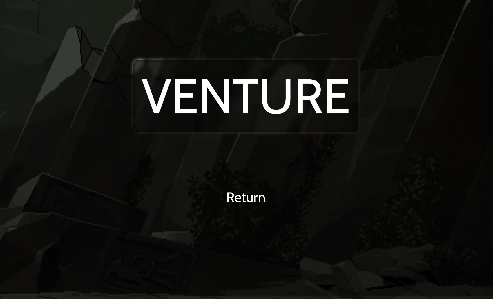
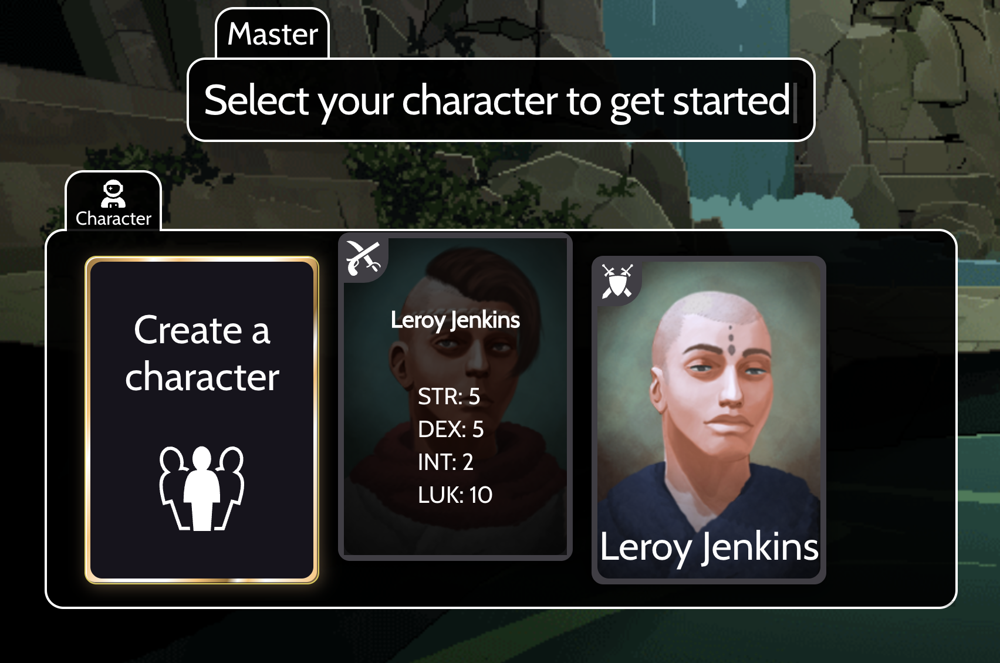

<div id="top"></div>


<!-- PROJECT LOGO -->
<br />
<div align="center">
  <h1 align="center"> Venture DEMO </h1>
  
  <h2 align="center"> Work in progress </h2>
  
  <p align="center">
    Venture is an app to seamlessly run a Dungeons and Dragons campaign through a card-based system for interaction
    <br />
    <br />
  </p>
  <h3> The problem worth solving </h3>
  <p align="center">
    Trying to get people willing to dive into the world of DnD is hard enough, while getting them to learn the rules, order, and limitations of their actions require even more patience and time.
    <br />
    <br />
  </p>
  
  <p align="center">
    This is where I aim to utilize my knowledge in building a web platform to create a live interactive experience between players and the dungeon master. An intuitive and user-friendly display to help start the curiosity of solving in-game puzzles and battles.
    <br />
    <br />
  </p>
<!-- TABLE OF CONTENTS -->
    <h3> Table of Contents </h3>
  <div><a href="#built-with">Built With</a></div>
  <div><a href="#goal">Goal</a></div>
  <div><a href="structure">Project Structure</a></div>
  <div><a href="#getting-started">Getting Started</a></div>
</div>


<div id="built-with">
  <h2>Built With</h2>
  <p  align="right">
    (<a href="#top">back to top</a>)
  </p>
</div>
<div align="center">
  <table>
    <tr>
      <td align="center">
        
      </td>
      <td>
        <a href="https://reactjs.org/">React</a>
      </td>
    </tr>
    <tr>
      <td align="center">
        
      </td>
      <td>
        <a href="https://chakra-ui.com/">Chakra-UI</a>
      </td>
    </tr>
    <tr>
      <td align="center">
        
      </td>
      <td>
        <a href="https://firebase.google.com/">Firebase</a>
      </td>
    </tr>
  </table>
</div>
<br />
<br />

<div id="structure">
  <h2>Project Structure</h2>
  <p  align="right">
    (<a href="#top">back to top</a>)
  </p>
</div>
<div align="left">

```
    ├── ...
    ├── _templates              # hygen generators (for `components` or `screens`)
    ├── src
    │   ├── api/Firestore       # Firestore class factories for `users`,`places` and `reviews`
    │   ├── components          # Shared front-end components using @Chakra/react
    │   ├── contexts            # Shared contexts for `Auth`,`Resize`,`Firestore`,`Places API`
    │   └── screens             # Screens for routes `/login`,`/dashboard`-admin,`/list`-user
    └── ...
```
</div>
<br />
<div id="getting-started">
  <h2>Getting started</h2>
  <p  align="right">
    (<a href="#top">back to top</a>)
  </p>
</div>

#### Step 1:
Install NPM packages
### `npm install` or `yarn`
#### Step 2:
Run local firebase servers
### `npm run servers` or `yarn servers`
#### Step 3:
Runs the app in the development mode.\
Open [http://localhost:3000](http://localhost:3000) to view it in the browser.
### `npm start` or `yarn start`
